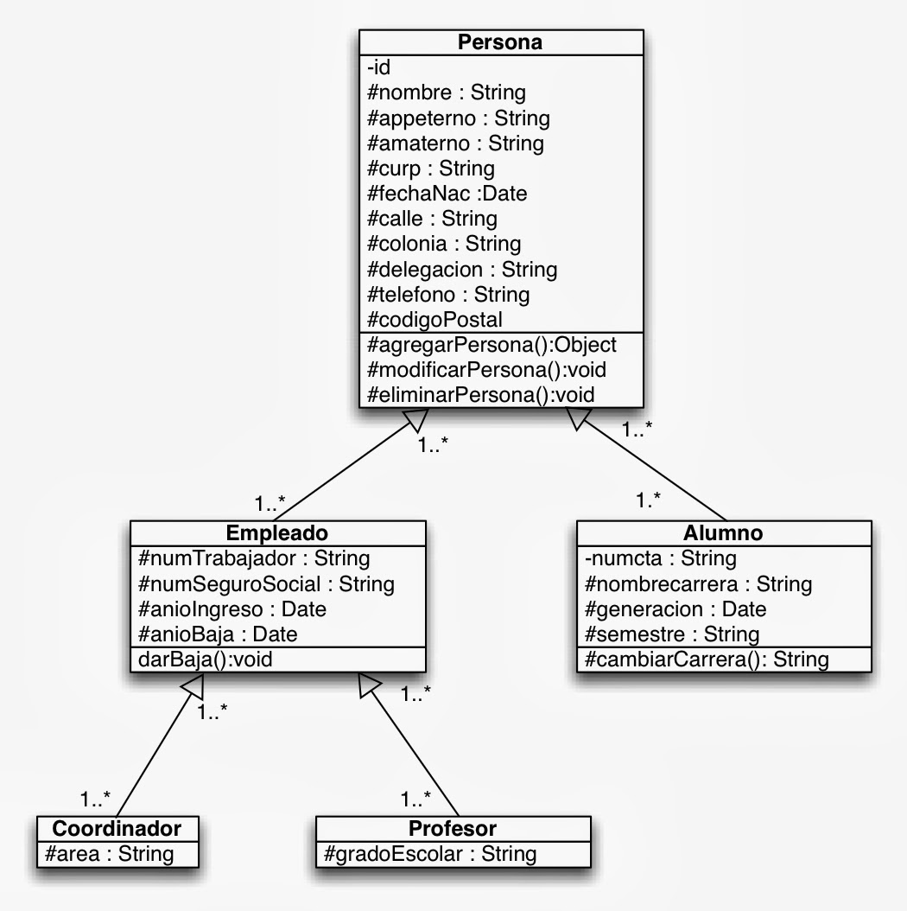

# Tipos de herencia en Django
Hay tres tipos de herencia disponible y cada uno se comporta de manera diferente a nivel tabla:

- Abstracta
- Multi tabla
- Proxy

## Herencia Abstracta
Este tipo de herencia nos permite poner una variedad de campos en común que deseamos que incluyan los modelos que hereden de este. Para definir un modelo como Abstracto basta con agregar la clase Meta que contenga un atributo llamado abstract igual a True. Django no va a crear ninguna tabla para un modelo con Meta.abstract = True.

```python
from django.db import models

class BasicData(models.Model):
    modified = models.DateTimeField(auto_now=True)
    created = models.DateTimeField(auto_now_add=True)

    class Meta:
        abstract = True

class Product(BasicData):
    name = models.CharField(max_length=150)
    description = models.TextField()

class ShippingMethod(BasicData):
    name = models.CharField(max_length=150)
    description = models.TextField()
    price = models.PositiveIntegerField()
```
En el ejemplo de arriba ambos modelos incluirán los campos de modified y created, sin embargo Django no creará ninguna tabla para el modelo BasicData.

## Herencia Multi Tabla
En este tipo de herencia Django sí creará una tabla por cada modelo (por eso se llama multi tabla). Además unirá ambos modelos automáticamente por medio de un campo OneToOneField en el modelo hijo.
```python
from django.db import models

class Place(models.Model):
    name = models.CharField(max_length=150)
    address = models.CharField(max_length=150)
    modified = models.DateTimeField(auto_now=True)
    created = models.DateTimeField(auto_now_add=True)

class Cafe(Place):
    number_of_employees = models.IntegerField()
    speciality_coffee_available = models.BooleanField(default=False)
```
En el ejemplo de arriba puede que nos interese tener ambos modelos, podemos filtrar por Place y luego podemos acceder al hijo por medio de su relación uno a uno usando su nombre de modelo en minúsculas.

```python
myFavoriteCafe = Place.objects.get(name="Matraz cafe")
print("Matraz Cafe has {} employees".format(myFavoriteCafe.cafe.number_of_employees))	
```	
### Herencia proxy
Este tipo de herencia se usa para cambiar o extender el comportamiento de un modelo. Para crearlo basta con añadir la clase Meta con el atributo proxy igual a True. En este caso ambos modelos se encuentran en la misma tabla y podemos crear, acceder, actualizar o borrar los datos usando cualquiera de sus modelos.
```python
from django.db import models

class BaseProduct(models.Model):
    modified = models.DateTimeField(auto_now=True)
    created = models.DateTimeField(auto_now_add=True)
    name = models.CharField(max_length=150)

    def __str__(self):
        return "{} created at {}".format(self.name, self.created.strftime("%H:%M")) 

class OrderedContent(BaseProduct):
    class Meta:
        proxy = True
        ordering = ['-created']	
```
En el ejemplo de arriba tenemos un nuevo modelo que define un ordenado predeterminado por medio del atributo ordering. Es decir, suponiendo que tuviéramos una tabla con datos podríamos acceder a los mismos datos a partir del ORM de Django.

```python
	from app.models import BaseProduct, OrderedContent

# Mismos datos, orden predeterminado
BaseProduct.objects.all()
<QuerySet [<BaseProduct: Eterno resplandor de una mente sin recuerdos created at 21:59>, <BaseProduct: Arrival created at 22:00>, <BaseProduct: The imitation game created at 22:01>]>

# Mismos datos, orden inverso
OrderedContent.objects.all()
<QuerySet [<OrderedContent: The imitation game created at 22:01>, <OrderedContent: Arrival created at 22:00>, <OrderedContent: Eterno resplandor de una mente sin recuerdos created at 21:59>]>
```
Como puedes ver pudimos acceder a los mismos tres objetos de la base de datos desde ambos modelos, con la diferencia de que en el modelo OrderedContent nuestros objetos aparecen ordenados descendentemente con respecto al campo created

# Práctica

Elabore una api RESTful que emplee el siguiente Diagrama:
- Utilice el tipo de herencia Abstracta


